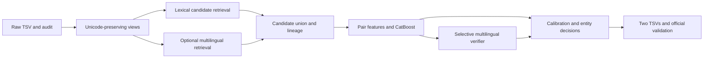

# Amazon ML Challenge 2026 — Business Entity Resolution

Private team workspace for resolving noisy Source 2/3 records to deduplicated Source 1 businesses.

**Current status: planning and reference material initialized. The matching pipeline and trained models are not yet implemented.** The detailed GitHub issues define the implementation work, dependencies, expected artifacts, example interfaces, data boundaries, and acceptance evidence.

- [Delivery project](https://github.com/users/Samanyu-dev/projects/5) — table, delivery board, and milestone roadmap
- [Implementation issues](https://github.com/Samanyu-dev/amazon-ml-challenge-2026-entity-resolution/issues)
- [Milestones](https://github.com/Samanyu-dev/amazon-ml-challenge-2026-entity-resolution/milestones)
- [Detailed roadmap](docs/roadmap.md)
- [Dataset contract and measured audit](docs/dataset.md)
- [Architecture and decision rationale](docs/architecture.md)
- [Validation and leakage policy](docs/validation.md)
- [Compute budget and run gates](docs/compute-budget.md)
- [Working agreements](CONTRIBUTING.md)
- [Issue ownership](docs/ownership.md)

## Objective

Find **zero, one, or many** S2/S3 matches for every test S1 reference. Optimize **macro F0.5 per reference business**, with both truth and prediction empty scoring 1. Test includes **France**, absent from labeled training. Every country must receive output rows.

## Proposed pipeline



Neural components ship only when measured quality/cost justifies them. A valid lexical/tree baseline remains available throughout.

## Dataset access

Obtain the supplied `student_resource/` privately through the team's authorized competition access. Keep it outside this Git checkout.

```bash
export DATA_ROOT="/absolute/path/to/student_resource/dataset"
```

Raw data, credentials, embeddings, model checkpoints, and generated outputs are ignored by Git. The repository contains only aggregate audit statistics, planning documents, templates, and the supplied validator. No cloud job has been launched by repository setup.

## Team

Repository owner: `Samanyu-dev`. Write-access invitations sent to `mrlegendary25`, `pranshustuff`, and `explorer271`; access depends on accepting invitations. The private project has writer access configured for these three users. Issues are allocated by workstream: data/infrastructure to `mrlegendary25`, modeling/decisions to `pranshustuff`, and retrieval/evaluation to `explorer271`. See [ownership](docs/ownership.md) for the exact issue map and pending-invitation status.

## First work to start

Assigned owners should start with the four ready foundation issues: ingestion/data contract, exact scorer, package/environment, and compute ledger. Complete the grouped split issue before supervised modeling. The project **Readiness** field and native blocked-by links expose dependencies; update readiness when prerequisites close.

## Submission artifacts

The final implementation must generate `output/matching_results.tsv` and `output/candidate_pairs.tsv`, plus a reproducible archive as described in [architecture](docs/architecture.md). Both TSVs must contain every test reference exactly once. Candidate output is the real input to the composite matching model, including cheap-stage rejects.

## Constraints and provenance

Use only provided business data for identity resolution; no external business registration lookup, geocoding, commercial ER API, or internet-derived data augmentation. Final models must meet the stated MIT/Apache-2.0 and <=8B-parameter requirement. Pin and audit every selected checkpoint. See [vendor provenance](vendor/student_resource/PROVENANCE.md).
